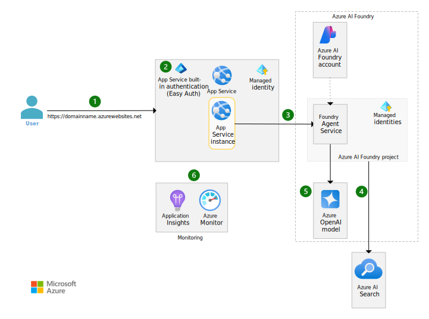

# Azure AI Foundry Agent service chat basic reference implementation

This reference implementation illustrates an approach running a chat application and an AI orchestration layer in a single region. It uses Azure AI Foundry Agent service as the orchestrator and Azure OpenAI foundation models. This repository directly supports the [Basic end-to-end chat reference architecture](https://learn.microsoft.com/azure/architecture/ai-ml/architecture/basic-openai-e2e-chat) on Microsoft Learn.

The reference implementation illustrates a basic example of a chat application. For a reference implementation that implements more enterprise requirements, please see the [Azure AI Foundry Agent service end-to-end baseline reference implementation](https://github.com/Azure-Samples/openai-end-to-end-baseline). That implementation addresses many of the [production readiness changes](https://github.com/search?q=repo%3AAzure-Samples%2Fopenai-end-to-end-basic+%22Production+readiness+change%22&type=code) identified in this code.

## Architecture

The implementation covers the following scenarios:

- [Setting up Azure AI Foundry to host agents](#setting-up-azure-ai-foundry-to-host-agents)
- [Deploying an agent into Azure AI Foundry Agent service](#deploying-an-agent-into-azure-ai-agent-service)
- [Invoking the agent from .NET code hosted in an Azure Web App](#invoking-the-agent-from-net-code-hosted-in-an-azure-web-app)

### Setting up Azure AI Foundry to host agents

Azure AI Foundry hosts Azure AI Foundry Agent service as a capability. Foundry Agent Service's REST APIs are exposed as an internet facing endpoint.



*Download a [Visio file](docs/media/openai-end-to-end-basic.vsdx) of this architecture.*

#### Workflow

The following workflow corresponds to the previous diagram:

1. An application user interacts with a web application that contains chat functionality. They issue an HTTPS request to the App Service default domain on azurewebsites.net. This domain automatically points to the App Service built-in public IP address. The Transport Layer Security connection is established from the client directly to App Service. Azure fully manages the certificate.
1. The App Service feature called Easy Auth ensures that the user who accesses the website is authenticated via Microsoft Entra ID.
1. The application code deployed to App Service handles the request and renders a chat UI for the application user. The chat UI code connects to APIs that are also hosted in that same App Service instance. The API code connects to an Azure AI agent in Azure AI Foundry by using the Azure AI Persistent Agents SDK.
1. Azure AI Foundry Agent Service connects to Azure AI Search to fetch grounding data for the query. The grounding data is added to the prompt that's sent to the Azure OpenAI model in the next step.
1. Foundry Agent Service connects to an Azure OpenAI model that's deployed in Azure AI Foundry and sends the prompt that includes the relevant grounding data and chat context.
1. Application Insights logs information about the original request to App Service and the call agent interactions.

### Deploying an agent into Azure AI Foundry Agent service

Agents can be created via the Azure AI Foundry portal, [Azure AI Persistent Agents client library](https://github.com/Azure/azure-sdk-for-net/tree/main/sdk/ai/Azure.AI.Agents.Persistent), or the [REST API](https://learn.microsoft.com/rest/api/aifoundry/aiagents/). The creation and invocation of agents are a data plane operation.

Ideally agents should be source-controlled and a versioned asset. You then can deploy agents in a coordinated way with the rest of your workload's code. In this deployment guide, you'll create an agent through the REST API to simulate a deployment pipeline which could have created the agent.

### Invoking the agent from .NET code hosted in an Azure Web App

A chat UI application is deployed into Azure App Service. The .NET code uses the [Azure AI Persistent Agents client library](https://github.com/Azure/azure-sdk-for-net/tree/main/sdk/ai/Azure.AI.Agents.Persistent) to connect to the workload's agent. The endpoint for the agent is exposed over internet through the Azure AI Foundry.

## Deployment guide

Follow these instructions to deploy this example to your Azure subscription, try out what you've deployed, and learn how to clean up those resources.

### Prerequisites

- An [Azure subscription](https://azure.microsoft.com/free/)

  - The subscription must have all of the resource providers used in this deployment [registered](https://learn.microsoft.com/azure/azure-resource-manager/management/resource-providers-and-types#register-resource-provider).

    - `Microsoft.CognitiveServices`
    - `Microsoft.Insights`
    - `Microsoft.ManagedIdentity`
    - `Microsoft.OperationalInsights`
    - `Microsoft.Storage`

  - The subscription must have the following quota available in the region you choose.

    - App Service Plans: P1v3 (AZ), 3 instances
    - OpenAI model: GPT-4o model deployment with 50k tokens per minute (TPM) capacity

- Your deployment user must have the following permissions at the subscription scope.

  - Ability to assign [Azure roles](https://learn.microsoft.com/azure/role-based-access-control/built-in-roles) on newly created resource groups and resources. (E.g. `User Access Administrator` or `Owner`)
  - Ability to purge deleted AI services resources. (E.g. `Contributor` or `Cognitive Services Contributor`)

- The [Azure CLI installed](https://learn.microsoft.com/cli/azure/install-azure-cli)

  If you're executing this from WSL, be sure the Azure CLI is installed in WSL and is not using the version installed in Windows. `which az` should show `/usr/bin/az`.

### 1. :rocket: Deploy the infrastructure

The following steps are required to deploy the infrastructure from the command line.

1. In your shell, clone this repo and navigate to the root directory of this repository.

   ```bash
   git clone https://github.com/Azure-Samples/openai-end-to-end-basic
   cd openai-end-to-end-basic
   ```

1. Log in and set your target subscription.

   ```bash
   az login
   az account set --subscription xxxxx
   ```

1. Set the deployment location to one with available quota in your subscription.

   This deployment has been tested in the following locations: `australiaeast`, `eastus`, `eastus2`, `francecentral`, `japaneast`, `southcentralus`, `swedencentral`, `switzerlandnorth`, or `uksouth`. You might be successful in other locations as well.

   ```bash
   LOCATION=eastus2
   ```

1. Set the base name value that will be used as part of the Azure resource names for the resources deployed in this solution.

   ```bash
   BASE_NAME=<base resource name, between 6 and 8 lowercase characters, all DNS names will include this text, so it must be unique.>
   ```

1. Create a resource group and deploy the infrastructure.

   *There is an optional tracking ID on this deployment. To opt out of its use, add the following parameter to the deployment code below: `-p telemetryOptOut true`.*

   ```bash
   RESOURCE_GROUP=rg-chat-basic-${BASE_NAME}
   az group create -l $LOCATION -n $RESOURCE_GROUP

   PRINCIPAL_ID=$(az ad signed-in-user show --query id -o tsv| tr -d '\r\n')

   # This takes about 10 minutes to run.
   az deployment group create -f ./infra-as-code/bicep/main.bicep \
     -g $RESOURCE_GROUP \
     -p baseName=${BASE_NAME} \
     -p yourPrincipalId=$PRINCIPAL_ID
   ```

### 2. Deploy an agent in the Azure AI Foundry Agent service

To test this scenario, you'll be deploying an AI agent. The agent uses a GPT model combined with a Bing search for grounding data. Deploying an AI agent requires data plane access to Azure AI Foundry. In this architecture, you will interact with the Azure AI Foundry portal and its resources over internet.

1. Open the Azure portal to your subscription.

1. Navigate to the Azure AI Foundry project named **projchat** in your resource group and open the Azure AI Foundry portal by clicking the Go to **Azure AI Foundry portal** button.

   This will take you directly into the 'Chat project'. Alternatively, you can find all your AI Foundry accounts and projects by going to <https://ai.azure.com> and you do not need to use the Azure portal to access them.

1. Click **Agents** in the side navigation.

1. Click **+ New agent** button.

1. From the Setup panel, change the Agent name to 'Baseline Chatbot Agent'.

1. Click **+ Add** button in the Knowledge section.

1. From the popup window select the knowledge type 'Grounding with Bing Search'.

1. Then choose the existing connection named 'bingaiagent' and click the **Connect** button.

### 3. Test the agent from the Azure AI Foundry portal in the playground.

Here you'll test your orchestration agent by invoking it directly from the Azure AI Foundry portal's playground experience.

1. Click the **Try in playground** button.

1. Enter a question that would require grounding data through recent internet content, such as a notable recent event or the weather today in your location.

1. A grounded response to your question should appear on the UI.

### 4. Publish the chat front-end web app

Workloads build chat functionality into an application. Those interfaces usually call Azure AI Foundry project endpoint invoking a particular agent. This implementation comes with such an interface. You'll deploy it to Azure App Service using the Azure CLI.

1. Generate some variables to set context.

   *The following variables align with the defaults in this deployment. Update them if you customized anything.*

   ```bash
   AI_FOUNDRY_NAME="aif${BASE_NAME}"
   AI_FOUNDRY_PROJECT_NAME="projchat"
   AI_FOUNDRY_AGENT_CREATE_URL="https://${AI_FOUNDRY_NAME}.services.ai.azure.com/api/projects/${AI_FOUNDRY_PROJECT_NAME}/assistants?api-version=2025-05-15-preview"

   echo $AI_FOUNDRY_AGENT_CREATE_URL
   ```

1. Get Agent ID value.

   ```bash
   AGENT_ID=$(az rest -u $AI_FOUNDRY_AGENT_CREATE_URL -m "get" --resource "https://ai.azure.com" --query 'data[0].id' -o tsv)

   echo $AGENT_ID
   ````

1. Update the app configuration to use the agent you deployed.

   ```bash
   APPSERVICE_NAME=app-$BASE_NAME

   az webapp config appsettings set -g $RESOURCE_GROUP -n $APPSERVICE_NAME --settings AIAgentId=${AGENT_ID}
   ````

1. Deploy the ChatUI web app

   ```bash
   az webapp deploy -g $RESOURCE_GROUP -n $APPSERVICE_NAME --type zip --src-url https://github.com/Azure-Samples/openai-end-to-end-basic/raw/refs/heads/main/website/chatui.zip
   ```

> Sometimes the prior command will fail with a `GatewayTimeout`. If you receive that error, you're safe to simply execute the command again.

### 5. Try it out! Test the deployed application that calls into the Azure AI Foundry Agent service

After the deployment is complete, you can try the deployed application by navigating to the Web App's URL in a web browser.

You can also execute the following from your workstation. Unfortunately, this command does not reliably work from Azure Cloud Shell.

```bash
az webapp browse -g $RESOURCE_GROUP -n $APPSERVICE_NAME
```

Once you're there, ask your solution a question. Your question should involve something that would only be known if the RAG process included context from Bing such as recent weather or events.

## :broom: Clean up resources

Most Azure resources deployed in the prior steps will incur ongoing charges unless removed. Additionally, a few of the resources deployed go into a soft delete status which will restrict the ability to redeploy another resource with the same name and might not release quota. It's best to purge any soft deleted resources once you are done exploring. Use the following commands to delete the deployed resources and resource group and to purge each of the resources with soft delete.

> **Note:** This will completely delete any data you may have included in this example and it will be unrecoverable.

```bash
# These deletes and purges take about 30 minutes to run.
az group delete -n $RESOURCE_GROUP -y

# Purge the soft delete resources
az cognitiveservices account purge -g $RESOURCE_GROUP -l $LOCATION -n aif${BASE_NAME}
```

## Contributions

Please see our [Contributor guide](./CONTRIBUTING.md).

This project has adopted the [Microsoft Open Source Code of Conduct](https://opensource.microsoft.com/codeofconduct/). For more information see the [Code of Conduct FAQ](https://opensource.microsoft.com/codeofconduct/faq/) or contact <opencode@microsoft.com> with any additional questions or comments.

With :heart: from Azure Patterns & Practices, [Azure Architecture Center](https://azure.com/architecture).
