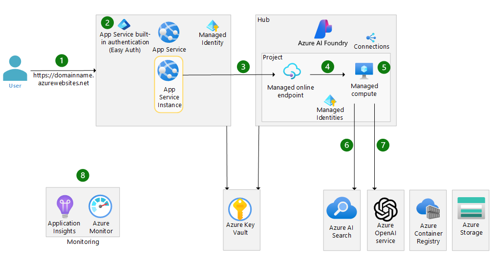

# Azure OpenAI end-to-end basic reference implementation

This reference implementation illustrates a basic approach for authoring and running a chat application in a single region with Azure Machine Learning and Azure OpenAI. This reference implementation supports the [Basic Azure OpenAI end-to-end chat reference architecture](https://learn.microsoft.com/azure/architecture/ai-ml/architecture/basic-openai-e2e-chat).

The implementation takes advantage of [Prompt flow](https://microsoft.github.io/promptflow/) in [Azure Machine Learning](https://azure.microsoft.com/products/machine-learning) to build and deploy flows that can link the following actions required by an LLM chat application:

- Creating prompts
- Querying data stores for grounding data
- Python code
- Calling Large Language Models (LLMs)

The reference implementation illustrates a basic example of a chat application.  For a reference implementation that implements enterprise requirements, please see the [OpenAI end-to-end baseline reference implementation](https://github.com/Azure-Samples/openai-end-to-end-baseline).

## Architecture

The implementation covers the following scenarios:

1. Authoring a flow - Authoring a flow using Prompt flow in an Azure Machine Learning workspace.
1. Deploying a flow - The client UI is hosted in Azure App Service and accesses the OpenAI service via a Machine Learning managed online endpoint.

### Deploying a flow to Azure Machine Learning managed online endpoint



The Azure Machine Learning deployment architecture diagram illustrates how a front-end web application connects to a managed online endpoint.

## Deployment guide

Follow these instructions to deploy this example to your Azure subscription, try out what you've deployed, and learn how to clean up those resources.

### Prerequisites

- An [Azure Account](https://azure.microsoft.com/free/)
- Your user has permissions to assign [Azure roles](https://learn.microsoft.com/azure/role-based-access-control/built-in-roles), such as a User Access Administrator or Owner.
- The [Azure CLI installed](https://learn.microsoft.com/cli/azure/install-azure-cli)
- The [az Bicep tools installed](https://learn.microsoft.com/azure/azure-resource-manager/bicep/install)

### 1. :rocket: Deploy the infrastructure

The following steps are required to deploy the infrastructure from the command line.

1. In your shell, navigate to the root directory of this repository.

1. Login and set subscription

   ```bash
   az login
   az account set --subscription xxxxx
   ```

1. Create a resource group and deploy the infrastructure.

   Make sure:

   - The BASE_NAME contains only lowercase letters and is between 6 and 8 characters. Most resource names will include this text.
   - You choose a valid resource group name.

   ```bash
   LOCATION=eastus
   BASE_NAME=<base-resource-name (between 6 and 8 lowercase characters)>

   RESOURCE_GROUP=<resource-group-name>
   az group create -l $LOCATION -n $RESOURCE_GROUP

   # This takes about 10 minutes to run.
   az deployment group create -f ./infra-as-code/bicep/main.bicep \
     -g $RESOURCE_GROUP \
     -p @./infra-as-code/bicep/parameters.json \
     -p baseName=$BASE_NAME
   ```

### 2. Create, test, and deploy a Prompt flow

1. Open the [Machine Learning Workspace](https://ml.azure.com/) and choose your workspace. Ensure you have [enabled Prompt flow in your Azure Machine Learning workspace](https://learn.microsoft.com/azure/machine-learning/prompt-flow/get-started-prompt-flow?view=azureml-api-2#prerequisites-enable-prompt-flow-in-your-azure-machine-learning-workspace).

1. Create a prompt flow connection to your gpt35 Azure OpenAI deployment. This will be used by the prompt flow you clone in the next step.
    1. Click on 'Connections' in the left navigation in Machine Learning Studio
    1. Click the 'Create' button
    1. Click 'Azure OpenAI Service'
    1. Your OpenAI instance should be displayed.  Change the Authentication method to 'Microsoft Entra ID'
    1. Click the 'Add connection' button
   
1. Clone an existing prompt flow
    1. Click on 'Prompt flow' in the left navigation in Machine Learning Studio
    1. Click on the 'Flows' tab and click 'Create'
    1. Click 'Clone' under 'Chat with Wikipedia'
    1. Name it 'chat_wiki' and Press 'Clone'

1. Connect the Prompt flow to your Azure OpenAI instance
    1. For extract_query_from_question:
       1. For 'Connection,' select your OpenAI instance from the dropdown menu
       1. For 'deployment_name', select 'gpt35' from the dropdown menu
       1. For 'response_format', select '{"type":"text"}' from the dropdown menu
    1. For augmented_chat:
       1. For 'Connection,' select your OpenAI instance from the dropdown menu
       1. For 'deployment_name', select 'gpt35' from the dropdown menu
       1. For 'response_format', select '{"type":"text"}' from the dropdown menu
    1. Click 'Save' to save your changes

1. Test the flow
   1. Click 'Start compute session' (This may take around 5 minutes)
   1. Click 'Chat' on the UI
   1. Enter a question
   1. A response to your question should appear on the UI

### 3. Deploy to Azure Machine Learning managed online endpoint

1. Create a deployment in the UI

   1. Click on 'Deploy' in the UI
   1. Choose 'Existing' Endpoint and select the one called _ept-\<basename>_
   1. Choose a small Virtual Machine size for testing and set the number of instances.
   1. Click 'Review + Create'
   1. Click 'Create'

### 4. Publish the chat front-end web app

The baseline architecture uses [run from zip file in App Service](https://learn.microsoft.com/azure/app-service/deploy-run-package). This approach has many benefits, including eliminating file lock conflicts when deploying.

```bash
APPSERVICE_NAME=app-$BASE_NAME

az webapp deploy --resource-group $RESOURCE_GROUP --name $APPSERVICE_NAME --type zip --src-url https://raw.githubusercontent.com/Azure-Samples/openai-end-to-end-basic/main/website/chatui.zip
```


## :checkered_flag: Try it out. Test the deployed application.

After the deployment is complete, you can try the deployed application by navigating to the AppService URL in a web browser.  Once you're there, ask your solution a question, ideally one that involves recent data or events, something that would only be known by the RAG process including content from Wikipedia.


## :broom: Clean up resources

Most of the Azure resources deployed in the prior steps will incur ongoing charges unless removed.

```bash
az group delete --name $RESOURCE_GROUP -y
az keyvault purge -n kv-${BASE_NAME}
```

## Contributions

Please see our [Contributor guide](./CONTRIBUTING.md).

This project has adopted the [Microsoft Open Source Code of Conduct](https://opensource.microsoft.com/codeofconduct/). For more information see the [Code of Conduct FAQ](https://opensource.microsoft.com/codeofconduct/faq/) or contact <opencode@microsoft.com> with any additional questions or comments.

With :heart: from Azure Patterns & Practices, [Azure Architecture Center](https://azure.com/architecture).
